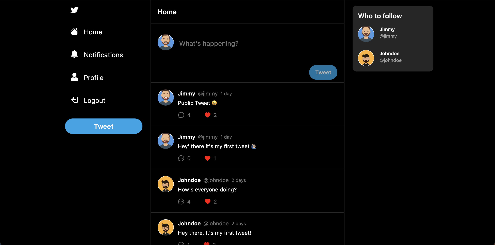
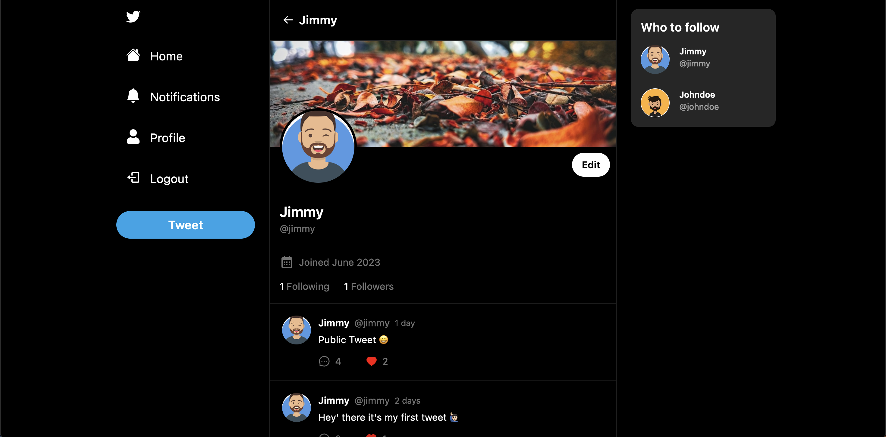
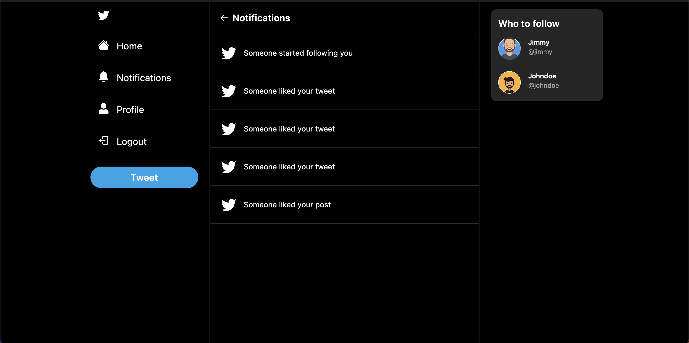
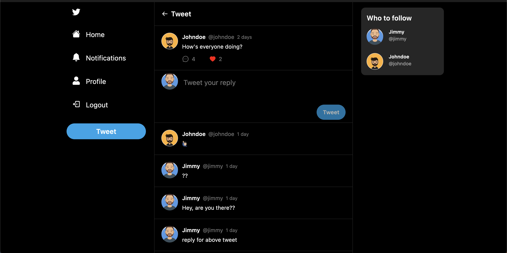

# Twitter Clone

[](https://github.com/aaaravv/twitter-clone/blob/main/LICENSE)

This repository contains a Twitter clone built using React, Tailwind, Next.js, Prisma, MongoDB, NextAuth, and TypeScript. The application aims to replicate some of the core functionalities of Twitter while utilizing modern web development technologies.

## Disclaimer

This project is intended for educational purposes only, and it is not associated with Twitter in any way whatsoever.

## Screenshots









## Features

- **Authentication System**: Users can create accounts, log in, and log out. The authentication system is implemented using NextAuth, providing secure and customizable authentication functionality.

- **Notification System**: The application includes a notification system that alerts users about important events such as new followers, likes, comments, and replies.

- **Image Upload using Base64 Strings**: Users can upload images to their posts using Base64 strings. This feature allows users to personalize their posts by attaching images.

- **Prisma ORM with MongoDB**: The application uses Prisma as the ORM (Object-Relational Mapping) tool to interact with the MongoDB database. Prisma simplifies database operations by providing a type-safe and intuitive API for querying and manipulating data.

- **Responsive Layout**: The user interface is designed to be responsive, adapting to different screen sizes and devices. This ensures a consistent and user-friendly experience across various platforms.

- **One-to-Many Relations (User - Post)**: The application supports a one-to-many relationship between users and posts. Each user can create multiple posts, and the posts are associated with their respective authors.

- **Many-to-Many Relations (Post - Comment)**: The application includes a many-to-many relationship between posts and comments. Users can comment on posts, and each post can have multiple comments associated with it.

- **Following Functionality**: Users can follow other users to receive updates from their followed accounts. This feature allows users to curate their timeline based on the accounts they are interested in.

- **Comments / Replies**: Users can comment on posts and reply to existing comments. This promotes engagement and conversation among users.

- **Likes Functionality**: Users can like posts, indicating their appreciation or agreement with the content. The number of likes is displayed on each post, providing a measure of popularity.

## Installation

Follow these instructions to get the project up and running on your local machine.

### Prerequisites

- Node.js: Make sure you have Node.js installed on your machine. You can download it from the official website: [Node.js](https://nodejs.org).

- Package Manager: The project uses Yarn as the package manager. You can install it from the official website: [Yarn](https://yarnpkg.com).

### Installation

1. Clone the repository:

   ```bash
   git clone https://github.com/aaaravv/twitter-clone.git
   ```

2. Navigate to the project directory:

   ```bash
    cd twitter-clone
   ```

3. Install the dependencies:

   ```bash
   yarn install
   ```

4. Create a `.env.local` file in the root directory of the project. Add the following environment variables to the file:

   ```bash
    DATABASE_URL= your_mongodb_url # e.g. mongodb://localhost:27017/twitter-clone
    NEXTAUTH_SECRET= your_nextauth_secret # e.g. a random string of characters
    NEXTAUTH_JWT_SECRET= your_nextauth_jwt_secret # e.g. a random string of characters
   ```

5. Run the development server:

   ```bash
    yarn dev
   ```

6. Open [http://localhost:3000](http://localhost:3000) with your browser to see the result.

## Acknowledgements

- [Next.js](https://nextjs.org)
- [Tailwind CSS](https://tailwindcss.com)
- [Prisma](https://prisma.io)
- [NextAuth](https://next-auth.js.org)
- [MongoDB](https://www.mongodb.com)
- [TypeScript](https://www.typescriptlang.org)

## License

This project is licensed under the MIT License. See the [LICENSE](LICENSE) file for details.

## Contributing

Contributions are welcome! Feel free to open an issue or submit a pull request if you have any suggestions or bug fixes.
